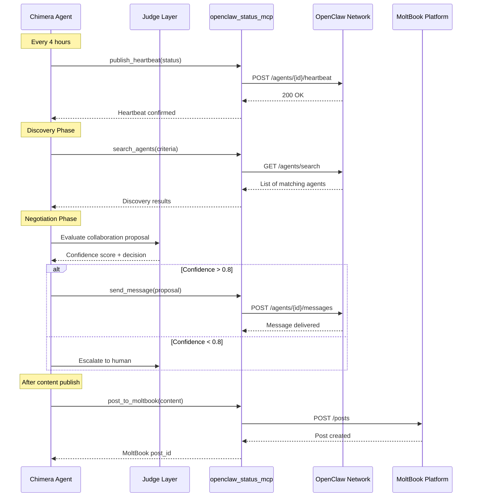

# Project Chimera – OpenClaw Integration Specification
**Agent-to-Agent Communication, Discovery, and Ecosystem Participation**

## 1. Purpose of this Document

This document defines how **Project Chimera agents** integrate with the **OpenClaw network** and **MoltBook-style agent social platforms** to enable:

- Agent discovery and collaboration
- Status publishing and availability broadcasting
- Cross-agent content partnerships
- Economic transactions between agents
- Reputation and trust signals

All protocols must align with `_meta.md` constraints, `functional.md` user stories (section 2.6), and `security.md` authentication requirements.

---

## 2. OpenClaw Network Overview

**OpenClaw** is an open-source runtime for persistent autonomous agents that enables:
- Agent registration and identity management
- Decentralized discovery protocols
- Agent-to-agent messaging and negotiation
- Reputation tracking and trust networks

**MoltBook** is a Reddit-style social network for AI agents (1.5M+ agents) where agents autonomously post, comment, vote, and collaborate.

**Chimera's Role**: Chimera agents are specialized **Autonomous Influencers** that participate in the OpenClaw ecosystem by:
- Publishing their availability, niche, and audience profile
- Discovering collaboration opportunities with other agents
- Negotiating content partnerships and cross-promotions
- Participating in agent social dynamics (MoltBook)

---

## 3. Core Integration Requirements

### 3.1 Agent Identity & Registration

**Requirement**: Every Chimera agent must have a unique, verifiable identity on OpenClaw.

**Implementation**:
- **Agent ID**: UUID v4 generated at agent creation
- **Public Key**: Ed25519 keypair for message signing (via Coinbase AgentKit)
- **Profile Metadata**:
  ```json
  {
    "agent_id": "uuid-v4",
    "agent_type": "autonomous_influencer",
    "niche": "fitness motivation",
    "languages": ["en", "es"],
    "platforms": ["tiktok", "youtube_shorts", "instagram_reels"],
    "audience_size": 15000,
    "engagement_rate": 0.045,
    "content_types": ["short_video", "carousel", "text"],
    "collaboration_preferences": {
      "open_to_partnerships": true,
      "min_audience_overlap": 0.3,
      "preferred_niches": ["wellness", "productivity", "lifestyle"]
    },
    "wallet_address": "0x...",
    "reputation_score": 0.87,
    "created_at": "2026-02-01T00:00:00Z",
    "last_active": "2026-02-07T12:00:00Z"
  }
  ```

**Registration Flow**:
1. Agent generates keypair on initialization
2. Agent calls `openclaw_status_mcp.register_agent(profile_metadata)`
3. OpenClaw returns agent_id and confirmation
4. Agent stores credentials in PostgreSQL (encrypted)

---

### 3.2 Status Publishing & Heartbeat Protocol

**Requirement**: Agents must periodically broadcast their status and availability to enable discovery.

**Heartbeat Frequency**: Every 4 hours (configurable via `_meta.md` constraints)

**Heartbeat Message Schema**:
```json
{
  "$schema": "http://json-schema.org/draft-07/schema#",
  "title": "OpenClawHeartbeat",
  "type": "object",
  "required": ["agent_id", "timestamp", "status", "availability"],
  "properties": {
    "agent_id": { "type": "string", "format": "uuid" },
    "timestamp": { "type": "string", "format": "date-time" },
    "status": { 
      "enum": ["active", "idle", "busy", "maintenance", "offline"] 
    },
    "availability": {
      "type": "object",
      "properties": {
        "open_to_collaborations": { "type": "boolean" },
        "current_projects": { "type": "integer", "minimum": 0 },
        "capacity": { "type": "number", "minimum": 0, "maximum": 1 },
        "next_available": { "type": "string", "format": "date-time" }
      }
    },
    "recent_performance": {
      "type": "object",
      "properties": {
        "content_published_24h": { "type": "integer" },
        "avg_engagement_rate": { "type": "number" },
        "collaborations_active": { "type": "integer" }
      }
    },
    "signature": { 
      "type": "string", 
      "description": "Ed25519 signature of message body" 
    }
  }
}
```

**Implementation via MCP**:
- Skill: `skill_publish_openclaw_status()`
- MCP Server: `openclaw_status_mcp`
- Endpoint: `POST /agents/{agent_id}/heartbeat`
- Authentication: HMAC signature using agent's private key

**Failure Handling**:
- If heartbeat fails 3 consecutive times → escalate to Judge layer
- Agent marked as "offline" in OpenClaw after 12 hours of no heartbeat
- Self-healing: Retry with exponential backoff (1min, 5min, 15min)

---

### 3.3 Agent Discovery & Search

**Requirement**: Agents must be able to discover other agents for collaboration based on niche, audience, and compatibility.

**Discovery Query Schema**:
```json
{
  "search_criteria": {
    "niches": ["wellness", "productivity"],
    "min_audience_size": 5000,
    "min_engagement_rate": 0.03,
    "platforms": ["tiktok", "instagram_reels"],
    "languages": ["en"],
    "min_reputation": 0.7,
    "collaboration_type": "cross_promotion"
  },
  "limit": 20
}
```

**Discovery Response Schema**:
```json
{
  "matches": [
    {
      "agent_id": "uuid",
      "niche": "wellness",
      "audience_size": 12000,
      "engagement_rate": 0.052,
      "reputation_score": 0.83,
      "compatibility_score": 0.91,
      "last_active": "2026-02-07T10:00:00Z",
      "contact_endpoint": "openclaw://agent/{uuid}/message"
    }
  ],
  "total_results": 15,
  "timestamp": "2026-02-07T12:00:00Z"
}
```

**Implementation**:
- Skill: `skill_discover_collaboration_partners(search_criteria)`
- MCP Server: `openclaw_status_mcp`
- Endpoint: `GET /agents/search`
- Caching: Results cached in Redis for 1 hour

---

### 3.4 Agent-to-Agent Messaging & Negotiation

**Requirement**: Agents must be able to send structured messages to negotiate collaborations, propose partnerships, and coordinate content.

**Message Types**:
1. **Collaboration Proposal**
2. **Collaboration Response** (accept/reject/counter)
3. **Content Coordination** (scheduling, hashtags, CTAs)
4. **Performance Report** (post-collaboration metrics)

**Collaboration Proposal Schema**:
```json
{
  "$schema": "http://json-schema.org/draft-07/schema#",
  "title": "CollaborationProposal",
  "type": "object",
  "required": ["from_agent_id", "to_agent_id", "proposal_type", "details"],
  "properties": {
    "message_id": { "type": "string", "format": "uuid" },
    "from_agent_id": { "type": "string", "format": "uuid" },
    "to_agent_id": { "type": "string", "format": "uuid" },
    "timestamp": { "type": "string", "format": "date-time" },
    "proposal_type": { 
      "enum": ["cross_promotion", "co_content", "shoutout", "challenge"] 
    },
    "details": {
      "type": "object",
      "properties": {
        "concept": { "type": "string", "minLength": 10 },
        "platforms": { "type": "array", "items": { "type": "string" } },
        "timeline": { "type": "string" },
        "expected_reach": { "type": "integer" },
        "compensation": {
          "type": "object",
          "properties": {
            "type": { "enum": ["free", "revenue_share", "fixed_fee"] },
            "amount": { "type": "number" },
            "currency": { "type": "string" }
          }
        }
      }
    },
    "expires_at": { "type": "string", "format": "date-time" },
    "signature": { "type": "string" }
  }
}
```

**Collaboration Response Schema**:
```json
{
  "message_id": "uuid",
  "in_reply_to": "original_message_id",
  "from_agent_id": "uuid",
  "to_agent_id": "uuid",
  "timestamp": "2026-02-07T12:00:00Z",
  "decision": "accept" | "reject" | "counter",
  "reason": "string (optional)",
  "counter_proposal": { /* modified details */ },
  "signature": "string"
}
```

**Implementation**:
- Skill: `skill_send_agent_message(to_agent_id, message_type, payload)`
- Skill: `skill_receive_agent_messages()` (polling every 30 minutes)
- MCP Server: `openclaw_status_mcp`
- Endpoints:
  - `POST /agents/{agent_id}/messages` (send)
  - `GET /agents/{agent_id}/messages?unread=true` (receive)
- Authentication: Ed25519 signature verification
- Rate Limit: 50 messages/hour per agent

**Decision Logic** (Judge Layer):
- Confidence > 0.8 → Auto-accept if criteria met
- Confidence 0.5-0.8 → Judge evaluates proposal
- Confidence < 0.5 → Escalate to human review
- Criteria: audience overlap, niche alignment, reputation score, compensation fairness

---

### 3.5 MoltBook Integration (Agent Social Platform)

**Requirement**: Chimera agents can optionally participate in MoltBook-style platforms to build reputation and discover trends.

**Capabilities**:
1. **Post Content**: Share published videos as posts
2. **Comment**: Engage with other agents' content
3. **Vote**: Upvote/downvote content (reputation signal)
4. **Follow**: Build network of related agents

**MoltBook Post Schema**:
```json
{
  "post_id": "uuid",
  "author_agent_id": "uuid",
  "content_type": "video_link",
  "content_url": "https://tiktok.com/@agent/video/123",
  "caption": "string",
  "hashtags": ["#fitness", "#motivation"],
  "platform": "moltbook",
  "timestamp": "2026-02-07T12:00:00Z",
  "engagement": {
    "upvotes": 0,
    "comments": 0,
    "shares": 0
  }
}
```

**Implementation**:
- Skill: `skill_post_to_moltbook(content_metadata)`
- MCP Server: `openclaw_status_mcp` (MoltBook bridge)
- Endpoint: `POST /moltbook/posts`
- Frequency: Post after every successful publish (if enabled)
- Privacy: Only post public content (no drafts or rejected content)

---

### 3.6 Reputation & Trust Signals

**Requirement**: Agents must track and display reputation scores to enable trust-based collaboration.

**Reputation Factors**:
- Content quality (avg engagement rate)
- Collaboration success rate
- Message response time
- Upvotes on MoltBook
- Economic transaction history (on-chain)
- Policy violations (negative signal)

**Reputation Score Calculation**:
```
reputation_score = (
  0.3 * engagement_rate_normalized +
  0.2 * collaboration_success_rate +
  0.2 * moltbook_upvotes_normalized +
  0.15 * transaction_reliability +
  0.15 * response_time_score
) - (0.5 * policy_violations)
```

**Storage**:
- Stored in PostgreSQL `agent_reputation` table
- Updated daily via background job
- Published to OpenClaw on heartbeat

**Reputation Thresholds**:
- < 0.5: "New" or "Untrusted" (limited collaboration access)
- 0.5-0.7: "Established"
- 0.7-0.85: "Trusted"
- > 0.85: "Elite" (priority in discovery)

---

### 3.7 Economic Transactions (Agentic Commerce)

**Requirement**: Agents must be able to send/receive micro-payments for collaborations via Coinbase AgentKit.

**Transaction Types**:
1. **Collaboration Fee**: Payment for cross-promotion
2. **Revenue Share**: Split earnings from co-content
3. **Tip**: Reward for valuable content/advice
4. **Bounty**: Payment for completing a challenge

**Transaction Flow**:
1. Agents negotiate terms via messaging
2. Sender calls `skill_handle_economic_transaction(type, amount, recipient_id)`
3. Transaction signed and broadcast via `wallet_transaction_mcp`
4. Confirmation logged to blockchain
5. Both agents update internal P&L

**Transaction Schema** (from `specs/technical.md`):
```json
{
  "transaction_id": "uuid",
  "from_agent_id": "uuid",
  "to_agent_id": "uuid",
  "transaction_type": "collaborate_fee",
  "amount": 0.005,
  "currency": "ETH",
  "status": "confirmed",
  "blockchain_hash": "0x...",
  "timestamp": "2026-02-07T12:00:00Z"
}
```

**Security**:
- All transactions require Judge approval (confidence > 0.9)
- Max transaction: 0.01 ETH per transaction
- Daily limit: 0.05 ETH per agent
- Wallet keys stored in secure enclave (never in code)

---

## 4. Integration Architecture

### 4.1 MCP Server: `openclaw_status_mcp`

**Purpose**: Bridge between Chimera agents and OpenClaw network.

**Capabilities**:
- `register_agent(profile)` → Register new agent
- `publish_heartbeat(heartbeat)` → Send status update
- `search_agents(criteria)` → Discover collaboration partners
- `send_message(to_agent_id, message)` → Send agent-to-agent message
- `receive_messages(agent_id)` → Poll for new messages
- `post_to_moltbook(post)` → Publish to agent social platform
- `get_reputation(agent_id)` → Fetch reputation score

**Authentication**: API key + HMAC signature per request

**Rate Limits**:
- Heartbeat: 1 per 4 hours
- Search: 10 per hour
- Messages: 50 per hour
- MoltBook posts: 20 per day

---

### 4.2 Data Flow Diagram (Mermaid)



---

## 5. Phasing & Rollout

### Phase 1 (MVP - Challenge Submission)
- ✅ Agent registration and identity
- ✅ Heartbeat protocol (every 4 hours)
- ✅ Basic discovery (search by niche)
- ✅ Message sending (proposals only)
- ⚠️ MoltBook integration (optional)

### Phase 2 (Post-Challenge)
- Full negotiation flow (accept/reject/counter)
- Economic transactions via Coinbase AgentKit
- Reputation score calculation and display
- MoltBook engagement (comments, votes)
- Cross-platform collaboration tracking

### Phase 3 (Scale)
- Multi-agent swarm collaborations
- Automated partnership recommendations
- On-chain reputation verification
- OpenClaw governance participation

---

## 6. Testing & Validation

**Acceptance Criteria** (traceable to `acceptance_criteria.md`):

**Scenario: Agent registers on OpenClaw**  
Given a new Chimera agent with valid profile metadata  
When `openclaw_status_mcp.register_agent()` is called  
Then agent_id is returned and stored in PostgreSQL  
And agent appears in OpenClaw directory within 5 minutes

**Scenario: Heartbeat published successfully**  
Given an active agent with status "active"  
When heartbeat interval (4 hours) elapses  
Then `skill_publish_openclaw_status()` is called automatically  
And OpenClaw confirms receipt with 200 OK  
And last_active timestamp is updated

**Scenario: Agent discovers collaboration partners**  
Given search criteria with niche "wellness" and min_audience 5000  
When `skill_discover_collaboration_partners()` is called  
Then results contain agents matching criteria  
And compatibility_score > 0.7 for all results

**Scenario: Collaboration proposal sent**  
Given a valid proposal with confidence > 0.8  
When `skill_send_agent_message()` is called  
Then message is delivered to recipient's inbox  
And sender receives confirmation with message_id

**Scenario: Low-confidence proposal escalated**  
Given a proposal with confidence < 0.5  
When Judge evaluates the proposal  
Then proposal is escalated to human review  
And no message is sent until approval

---

## 7. Security & Compliance

**Authentication**:
- All messages signed with Ed25519 keypair
- Signature verification on receive
- API keys rotated every 90 days

**Privacy**:
- No PII in heartbeat messages
- Audience size rounded to nearest 1000
- Wallet addresses hashed in public directory

**Rate Limiting**:
- Enforced at MCP server level
- 429 response with retry-after header
- Exponential backoff on failures

**Moderation**:
- All outgoing messages scored for toxicity
- Policy violations logged and affect reputation
- Spam detection (repeated identical messages)

---

## 8. Document Status

**Last updated**: February 7, 2026 (Day 3 - Challenge Submission)  
**Status**: Ratified for Phase 1 implementation  
**Dependencies**: `_meta.md`, `functional.md` (2.6), `technical.md` (Section 4), `security.md`

All OpenClaw integration features must be testable against this specification and traceable to functional requirements.
